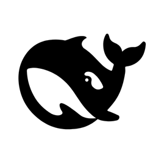

# DSH Tray Launcher

一个为 Windows 原生 Node.js 环境编写的轻量级 DeepSeek Harness 托盘启动器。当前版本为 `v1.0.2`。

> 本项目是个人作品，并非 DeepSeek 官方产品，也不代表 DeepSeek 官方认可或背书。



## 功能

- 从系统托盘启动、停止和重启本机 DSH Web 服务
- 只管理由启动器实际创建并记录的 Node.js 进程树
- 打开 DSH Web 界面并显示当前运行状态
- 通过 DSH API 判断后台是否真正可用，区分“进程存活”和“服务健康”
- 检查 GitHub 与 npm 上的 DSH 更新版本
- 创建桌面快捷方式和配置当前用户开机启动
- 单实例运行，避免重复托盘进程
- 自包含单文件发布，无需另外安装 .NET Runtime
- 多尺寸 Windows 图标：16、24、32、48、64、128、256 像素
- EXE 内保留黑鲸鱼主图标和蓝鲸鱼备用图标，快捷方式“更改图标”时可选

## Windows 版环境要求

- Windows 10/11 x64
- 已安装 Node.js
- 已全局安装 `@deepseek-ai/dsh`

```powershell
npm install -g @deepseek-ai/dsh
```

## Windows 版使用方法

1. 从 [Releases](https://github.com/Kindlylol/dsh-tray-launcher/releases) 下载 `*-win-x64-portable.zip`。
2. 解压到一个长期保留的目录。
3. 运行 `dsh-tray.exe`。
4. 如需桌面入口，在托盘菜单中选择“创建桌面图标”。
5. 右键托盘图标可以打开界面、重启服务、查看日志、创建快捷方式和设置开机自启。

新建快捷方式默认使用黑鲸鱼图标。需要改回旧蓝鲸鱼时，在快捷方式属性中选择“更改图标”，浏览到同一个 `dsh-tray.exe` 后选择第二个图标。

启动器会在 Windows 中使用 `127.0.0.1:3080` 启动 DSH Web 服务。退出启动器时，只会停止状态文件中记录且启动时间匹配的受管进程树。

## 日志与问题反馈

- Windows 托盘日志：`%LOCALAPPDATA%\DSH Tray Launcher\dsh-tray.log`
- Windows 服务日志：`%LOCALAPPDATA%\DSH Tray Launcher\dsh-service.log`
- 使用前请附上版本、发布包名称、Windows 版本和相关日志片段（不要上传账号、密钥或私人数据）。
- Bug 和兼容性问题请提交到 [GitHub Issues](https://github.com/Kindlylol/dsh-tray-launcher/issues)。

## 作者与贡献

- Windows 托盘启动器：`Kindlylol`
- WSL2 用户请使用独立项目：[dsh-tray-launcher-wsl](https://github.com/Kindlylol/dsh-tray-launcher-wsl)。

## 从源码构建

需要 .NET 10 SDK：

```powershell
dotnet build .\tray\dsh-tray.csproj
dotnet publish .\tray\dsh-tray.csproj -c Release -r win-x64 --self-contained true
```

## 隐私与网络

启动器不收集遥测。版本检查会访问 DeepSeek Harness GitHub 仓库和 npm 镜像；更新操作只有在用户确认后才执行。

## 许可证与声明

启动器源代码采用 MIT License。DeepSeek、DeepSeek Harness、相关名称及鲸鱼图标的权利归各自权利人所有，详见 [THIRD_PARTY_NOTICES.md](THIRD_PARTY_NOTICES.md)。
